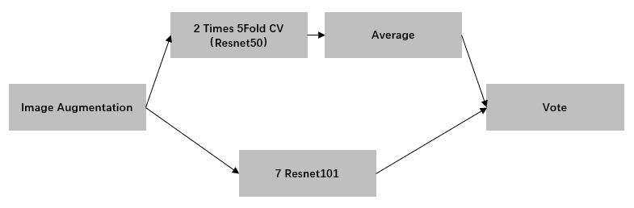

# Intel Scene Classification at Analytics Vidhya Platform

This is the solution of 6th place for [Intel Scene Classification Challenge](https://datahack.analyticsvidhya.com/contest/practice-problem-intel-scene-classification-challe/). Our solution is equipped with a suit of techniques including augmentaion, 
hard example mining, fine-tuning and ensemble. The whole model could be see in the below:

## Methods and Notes

* 5 fold CV is coded with [[tensorflow](https://github.com/tensorflow/tensorflow) and [slim](https://github.com/tensorflow/tensorflow/tree/master/tensorflow/contrib/slim/python/slim) libraries. Based on the CV results, we explore the hard examples from the training set for further attention.
* Image augmentation is consists of [Augmentor](https://github.com/mdbloice/Augmentor) and [fastai vision.transforms](https://docs.fast.ai/vision.transform.html).
* 7 different seeds of resnet101 is trained on fastai with oversampling of  the hard examples.
* Voting performs bettter than weighting at the final ensemble stage.